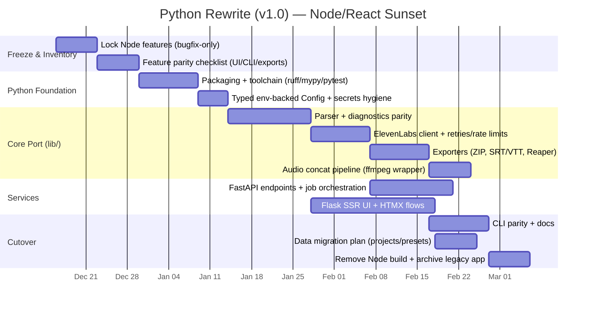

# Roadmap — ElevenLabs Screenplay Formatter

This roadmap focuses on future enhancements and remaining quality-of-life improvements. For completed features, see [CHANGELOG.md](./CHANGELOG.md).

---

## Current Status

**Version 0.4.0** has shipped with comprehensive features:
- ✅ Full screenplay parsing with Fountain support
- ✅ ElevenLabs integration with all voice models
- ✅ Project management and voice presets
- ✅ Timeline view and per-line preview
- ✅ Export to multiple formats (ZIP, Reaper, SRT/VTT)
- ✅ CLI for batch processing
- ✅ Audio production with SFX and background music
- ✅ Shareable project URLs
- ✅ Core stability fixes (IndexedDB migration, memory leaks, error handling)

**Python rewrite status (v1.0 track):**
- ✅ `lib/` core port (parser, ElevenLabs client, generation, exports, ffmpeg wrapper) with pytest coverage
- ✅ FastAPI API + async jobs + SSE progress
- 🚧 Flask UI (Jinja2 + HTMX) is in progress; current “happy path” works end-to-end

---

## Strategic Pivot: Python-First (FastAPI + Flask) — v1.0 Track

We are sunsetting the Node.js/Vite/React implementation and rebuilding as a full Python project: **Flask + Jinja2 + HTMX** renders the HTML UI (progressive enhancement), while **FastAPI** serves JSON endpoints and job/progress execution (no HTML rendering). The shared core lives in `lib/` as a reusable, typed library with no web/framework imports.

For the step-by-step execution plan, see [MIGRATION_ROADMAP.md](./MIGRATION_ROADMAP.md).

### Constraints (Non-Negotiable)

- **No-Bloat:** Jinja2 templates + HTMX for interactivity; simple cookie/session auth; local/bare-metal assumptions (no Docker/K8s/Terraform).
- **Arsenal portability:** `lib/` must not import from app entrypoints, routers/views, or framework modules; use typed config objects (env-backed) and pass config into operations.
- **Type safety:** public functions fully typed; validate external inputs at boundaries (HTTP, files, env, model output).
- **Candlelight UI palette:** only `#121212`, `#EBD2BE`, `#A6ACCD`, `#98C379`, `#E06C75` in user-facing styles.

### Target Architecture

- `lib/` (pure, reusable): Fountain/parser, project model, ElevenLabs client, export builders (ZIP, SRT/VTT, Reaper), audio pipeline helpers, and validation.
- `apps/api/` (FastAPI): REST endpoints for parsing, generation, exports, health; background job execution; file upload/download boundaries; typed request/response models.
- `apps/web/` (Flask): SSR UI (Jinja2) + HTMX actions that call into `lib/` directly (or via internal API if we choose to isolate); cookie/session; Candlelight theme.
- `cli/` (Python): batch processing CLI that reuses `lib/` (feature-parity with current TS CLI).

### Migration Plan (Plotted)

### Acceptance Criteria (Definition of Done)

- [x] A single `python -m ...` (or `uv run ...`) starts the Flask UI and FastAPI API in local dev without Node (after installing Python deps).
- [x] Parser + diagnostics match current behavior on existing example scripts (`EXAMPLE_*.md`/`*.txt`).
- [/] CLI supports multi-script batch generation and local concatenation.
- [/] Export formats (ZIP/manifest, SRT/VTT, Reaper) are implemented in `lib/`; parity verification is ongoing.
- [x] No secrets committed; `.env` remains ignored; `.env.example` documents required values.

---

## Future Enhancements

### Testing & Quality Assurance

**Goal:** Improve reliability and prevent regressions through automated testing.

- [x] **Parser unit tests**
  - [x] Standard + Fountain parsing coverage (`tests/`)
  - [x] Share link encode/decode tests
  - [x] ZIP/manifest safety tests

- [/] **API client tests**
  - [x] HTTP safety + input boundary tests
  - [ ] Mock ElevenLabs API responses (no-network CI-safe)
  - [ ] Retry/rate-limit behavior tests

- [ ] **End-to-end tests** (Playwright for Python)
  - [ ] Load test script and assign voices
  - [ ] Mock API responses and verify UI flow
  - [ ] Test project save/load cycle
  - [ ] Validate resume functionality

- [ ] **Maintenance scripts**
  - [ ] GitHub Actions workflow for lint + tests on push/PR
  - [ ] Automated build verification

### Parser Enhancements

- [ ] **Parser diagnostics mode**
  - [ ] Optional "show parsed view" that lists detected characters and their lines
  - [ ] Highlight lines that failed to parse for user debugging
  - [ ] Character detection confidence scores

### Workflow & Automation

- [ ] **Batch processing improvements**
  - [ ] Sequential processing of multiple screenplay files (chapters/episodes)
  - [ ] Rate-limiting and cooldown between runs
  - [ ] Progress tracking across multiple files
  - [ ] Batch configuration presets

### Error Handling & Resilience

- [ ] **Better error recovery**
  - [ ] Automatic retry for transient network failures
  - [ ] Improved localStorage/IndexedDB corruption handling
  - [ ] Graceful degradation when backend is unavailable

- [ ] **Script validation**
  - [ ] Character/word count display
  - [ ] Estimated API cost calculator
  - [ ] Warning before processing extremely large scripts (50K+ words)
  - [ ] Memory usage estimation

### Developer Experience

- [ ] **Python packaging & dev ergonomics**
  - [ ] Standardize tooling (`ruff`, `mypy`, `pytest`) and a single-run dev command
  - [ ] Document local ffmpeg requirements and supported OSes
  - [ ] Add pre-commit hooks (optional, non-blocking)

### Integrations & Export Formats

- [ ] **Enhanced Reaper integration**
  - [ ] Export formats tailored for Reaper track templates
  - [ ] Marker/region generation for dialogue sections
  - [ ] Automatic track coloring by character

- [ ] **Additional DAW exports**
  - [ ] Pro Tools session templates
  - [ ] Logic Pro project format
  - [ ] Studio One export

### Backlog / Nice-to-Have Ideas

Ideas to revisit after core stability and testing are solid:

- [ ] **Advanced audio processing**
  - [ ] Real-time waveform preview
  - [ ] Basic audio normalization
  - [ ] Automatic silence trimming

- [ ] **Collaboration features**
  - [ ] Multi-user project editing (if needed)
  - [ ] Version history and diff view
  - [ ] Comment threads on dialogue lines

- [ ] **Cloud integration**
  - [ ] Optional cloud storage for projects
  - [ ] Sync across devices
  - [ ] Team libraries for voice presets

---

## Contributing

See [ARCHITECTURE.md](./ARCHITECTURE.md) for system overview and [CONTRIBUTING.md](./CONTRIBUTING.md) for development guidelines.

---

## Version History

- **v0.4.0** (2025-11-28) - Comprehensive feature release with all core functionality
- **v0.3.x** - Workflow automation and CLI
- **v0.2.x** - Parsing enhancements and UX improvements
- **v0.1.x** - MVP polishing and stability

See [CHANGELOG.md](./CHANGELOG.md) for detailed release notes.
